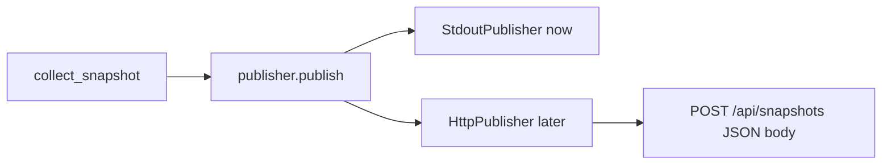

# MAC-Address Collection Implementation Plan

> **For agentic workers:** REQUIRED SUB-SKILL: Use superpowers:subagent-driven-development (recommended) or superpowers:executing-plans to implement this plan task-by-task. Steps use checkbox (`- [ ]`) syntax for tracking.

**Goal:** Build a Windows-first Python desktop monitoring collector that gathers network adapter MAC addresses (current + permanent), classifies adapters, selects a primary MAC without treating it as `host_id`, and emits the required `network` JSON.

**Architecture:** Pure functions for MAC normalization/classification/selection sit behind a Windows collector that prefers PowerShell (`Get-NetAdapter`, `Get-NetIPConfiguration`, `Get-NetRoute`) with timeouts and JSON output, falling back to `psutil`/`CIM` when needed. A thin orchestrator assembles the snapshot JSON; `host_id` is derived from non-MAC signals so MAC never becomes the sole machine identity. After every collection, the CLI calls a `Publisher.publish(snapshot)` hook: now `StdoutPublisher`, later swap in `HttpPublisher` to POST the same JSON body to your API. Each run sends a **new full snapshot**; the client does not delete prior local or server data.

**Tech Stack:** Python 3.11+, `psutil`, `pytest`, Windows PowerShell (subprocess list args, never `shell=True`)

## After each execution: how data reaches the server (later API)



- **Payload:** the full snapshot dict (`host_id` + `network` with all MAC fields). Same shape locally and on the wire.
- **When:** once per execution, immediately after collection succeeds.
- **Now:** `StdoutPublisher` prints JSON (dev/debug).
- **Later:** implement `HttpPublisher` in `transport.py` that `POST`s `Content-Type: application/json` to `DESKTOP_MONITORING_API_URL` (auth via `DESKTOP_MONITORING_API_TOKEN` bearer header). No API implementation in this plan—only the publish seam.
- **Prev data:** client does **not** remove previous snapshots. Server decides upsert-by-`host_id` vs append history. Failed publishes raise; they do not mutate already-collected snapshot contents.

## Global Constraints

- Normalized MAC format is exactly `AA:BB:CC:DD:EE:FF` (uppercase hex, colon-separated).
- Return `null` when a MAC is genuinely unavailable; never fabricate one.
- Never collect Wi-Fi passwords or security keys.
- PowerShell must use a timeout, must not use `shell=True`, and must return structured JSON.
- Exclude loopback from `physical_adapter_count`.
- Do not prefer virtual/Docker/WSL/Hyper-V/VMware/VirtualBox/VPN/Bluetooth/disconnected adapters as primary MAC unless they own the active preferred route and no physical alternative exists.
- Keep virtual adapters in `all_adapters` / `active_adapters`.
- If permanent and current MAC differ, return both without guessing which identifies the computer.
- Do not use only the MAC address as `host_id`.
- Generated JSON must always include `network.primary_mac_address`, `network.preferred_adapter.current_mac_address`, `network.preferred_adapter.permanent_mac_address`, and MAC fields on every `active_adapters` / `all_adapters` item.

---

## File Structure

```text
desktop-monitoring-app/
├── pyproject.toml
├── README.md
├── src/
│   └── desktop_monitoring/
│       ├── __init__.py
│       ├── __main__.py
│       ├── host_id.py
│       ├── snapshot.py
│       ├── transport.py
│       └── network/
│           ├── __init__.py
│           ├── mac.py
│           ├── classify.py
│           ├── select.py
│           ├── models.py
│           ├── powershell.py
│           └── collector.py
└── tests/
    ├── conftest.py
    ├── test_mac.py
    ├── test_classify.py
    ├── test_select.py
    ├── test_powershell.py
    ├── test_network_collector.py
    ├── test_host_id.py
    ├── test_snapshot_json_contract.py
    └── fixtures/
        ├── adapters_physical_wifi.json
        ├── adapters_virtual_preferred.json
        └── adapters_randomized_wifi.json
```

| File | Responsibility |
|------|----------------|
| `network/mac.py` | Normalize/validate MAC; detect locally administered bit |
| `network/classify.py` | Physical/virtual/loopback/adapter-type heuristics |
| `network/select.py` | Preferred adapter + primary MAC selection rules |
| `network/models.py` | TypedDict / dataclass shapes for adapters and network JSON |
| `network/powershell.py` | Timed PowerShell JSON helpers (no `shell=True`) |
| `network/collector.py` | Merge OS data into full `network` object |
| `host_id.py` | Stable host identity without MAC-only dependency |
| `snapshot.py` | Top-level collection entrypoint |
| `transport.py` | `Publisher` protocol; `StdoutPublisher` now; `HttpPublisher` stub/docs for later API |
| `README.md` | MAC sources, randomization, change reasons, selection rules, publish flow |

---

### Task 1: Project scaffolding

**Files:**
- Create: `pyproject.toml`
- Create: `src/desktop_monitoring/__init__.py`
- Create: `src/desktop_monitoring/network/__init__.py`
- Create: `tests/conftest.py`

**Interfaces:**
- Consumes: nothing
- Produces: installable package `desktop_monitoring` with pytest configured for `tests/`

- [ ] **Step 1: Create `pyproject.toml`**

```toml
[build-system]
requires = ["setuptools>=68", "wheel"]
build-backend = "setuptools.build_meta"

[project]
name = "desktop-monitoring"
version = "0.1.0"
description = "Desktop monitoring collector with mandatory MAC-address collection"
readme = "README.md"
requires-python = ">=3.11"
dependencies = [
  "psutil>=5.9",
]

[project.optional-dependencies]
dev = [
  "pytest>=8.0",
]

[project.scripts]
desktop-monitoring = "desktop_monitoring.__main__:main"

[tool.setuptools.packages.find]
where = ["src"]

[tool.pytest.ini_options]
testpaths = ["tests"]
pythonpath = ["src"]
```

- [ ] **Step 2: Create package init files**

`src/desktop_monitoring/__init__.py`:

```python
__version__ = "0.1.0"
```

`src/desktop_monitoring/network/__init__.py`:

```python
"""Network adapter and MAC-address collection."""
```

`tests/conftest.py`:

```python
from pathlib import Path

import pytest

FIXTURES = Path(__file__).parent / "fixtures"


@pytest.fixture
def fixtures_dir() -> Path:
    return FIXTURES
```

- [ ] **Step 3: Install editable package with dev deps**

Run: `python -m pip install -e ".[dev]"`
Expected: install succeeds; `pytest` is available

- [ ] **Step 4: Commit**

```bash
git add pyproject.toml src/desktop_monitoring/__init__.py src/desktop_monitoring/network/__init__.py tests/conftest.py
git commit -m "chore: scaffold Python package for MAC collection"
```

---

### Task 2: MAC normalize / validate / LAA detection

**Files:**
- Create: `src/desktop_monitoring/network/mac.py`
- Create: `tests/test_mac.py`

**Interfaces:**
- Consumes: nothing
- Produces:
  - `normalize_mac(value: str | None) -> str | None`
  - `is_randomized_or_locally_administered(mac: str | None) -> bool`

- [ ] **Step 1: Write failing tests**

```python
# tests/test_mac.py
import pytest

from desktop_monitoring.network.mac import (
    is_randomized_or_locally_administered,
    normalize_mac,
)


@pytest.mark.parametrize(
    "raw, expected",
    [
        ("aa-bb-cc-dd-ee-ff", "AA:BB:CC:DD:EE:FF"),
        ("AABBCCDDEEFF", "AA:BB:CC:DD:EE:FF"),
        ("aa:bb:cc:dd:ee:ff", "AA:BB:CC:DD:EE:FF"),
        ("AA:BB:CC:DD:EE:FF", "AA:BB:CC:DD:EE:FF"),
        (None, None),
        ("", None),
        ("   ", None),
        ("00:00:00:00:00:00", None),
        ("FF:FF:FF:FF:FF:FF", None),
        ("not-a-mac", None),
        ("AA:BB:CC:DD:EE", None),
        ("GG:BB:CC:DD:EE:FF", None),
    ],
)
def test_normalize_mac(raw, expected):
    assert normalize_mac(raw) == expected


@pytest.mark.parametrize(
    "mac, expected",
    [
        ("02:11:22:33:44:55", True),   # locally administered bit set
        ("06:11:22:33:44:55", True),
        ("0A:11:22:33:44:55", True),
        ("0E:11:22:33:44:55", True),
        ("00:11:22:33:44:55", False),
        ("AA:BB:CC:DD:EE:FF", False),  # U/L bit clear on first octet 0xAA
        (None, False),
        ("not-a-mac", False),
    ],
)
def test_is_randomized_or_locally_administered(mac, expected):
    assert is_randomized_or_locally_administered(mac) is expected
```

- [ ] **Step 2: Run tests to verify they fail**

Run: `pytest tests/test_mac.py -v`
Expected: FAIL with `ModuleNotFoundError` or `ImportError` for `desktop_monitoring.network.mac`

- [ ] **Step 3: Implement `mac.py`**

```python
# src/desktop_monitoring/network/mac.py
from __future__ import annotations

import re

_HEX_MAC = re.compile(r"^[0-9A-F]{12}$")
_INVALID = {"000000000000", "FFFFFFFFFFFF"}


def normalize_mac(value: str | None) -> str | None:
    """Return MAC as AA:BB:CC:DD:EE:FF, or None if missing/invalid."""
    if value is None:
        return None
    cleaned = re.sub(r"[^0-9A-Fa-f]", "", value.strip())
    if len(cleaned) != 12:
        return None
    upper = cleaned.upper()
    if not _HEX_MAC.match(upper) or upper in _INVALID:
        return None
    parts = [upper[i : i + 2] for i in range(0, 12, 2)]
    return ":".join(parts)


def is_randomized_or_locally_administered(mac: str | None) -> bool:
    """True when IEEE U/L bit (0x02) is set on the first octet."""
    normalized = normalize_mac(mac)
    if normalized is None:
        return False
    first_octet = int(normalized[0:2], 16)
    return bool(first_octet & 0x02)
```

- [ ] **Step 4: Run tests to verify they pass**

Run: `pytest tests/test_mac.py -v`
Expected: PASS

- [ ] **Step 5: Commit**

```bash
git add src/desktop_monitoring/network/mac.py tests/test_mac.py
git commit -m "feat: add MAC normalize and locally-administered detection"
```

---

### Task 3: Adapter classification

**Files:**
- Create: `src/desktop_monitoring/network/classify.py`
- Create: `tests/test_classify.py`

**Interfaces:**
- Consumes: nothing beyond string metadata
- Produces:
  - `is_loopback(name: str, description: str | None = None) -> bool`
  - `is_virtual_adapter(name: str, description: str | None = None, adapter_type: str | None = None) -> bool`
  - `infer_adapter_type(name: str, description: str | None = None, media_type: str | None = None) -> str`
  - Return type strings: `"wifi" | "ethernet" | "loopback" | "vpn" | "bluetooth" | "virtual" | "other"`

- [ ] **Step 1: Write failing tests**

```python
# tests/test_classify.py
from desktop_monitoring.network.classify import (
    infer_adapter_type,
    is_loopback,
    is_virtual_adapter,
)


def test_loopback_excluded_from_physical():
    assert is_loopback("Loopback Pseudo-Interface 1", "Software Loopback")
    assert is_loopback("lo", None)


def test_virtual_keywords():
    assert is_virtual_adapter("vEthernet (Default Switch)", "Hyper-V Virtual Ethernet Adapter")
    assert is_virtual_adapter("DockerNAT", "Docker")
    assert is_virtual_adapter("WSL", "WSL")
    assert is_virtual_adapter("VMware Network Adapter VMnet8", "VMware")
    assert is_virtual_adapter("VirtualBox Host-Only", "VirtualBox")
    assert is_virtual_adapter("NordLynx", "VPN", adapter_type="vpn")
    assert is_virtual_adapter("Bluetooth Network Connection", "Bluetooth")


def test_physical_wifi_and_ethernet():
    assert not is_virtual_adapter("Wi-Fi", "Intel(R) Wi-Fi 6 AX201 160MHz")
    assert not is_virtual_adapter("Ethernet", "Intel(R) Ethernet Connection")
    assert infer_adapter_type("Wi-Fi", "Intel Wi-Fi", "802.11") == "wifi"
    assert infer_adapter_type("Ethernet", "Intel Ethernet", "802.3") == "ethernet"
```

- [ ] **Step 2: Run tests to verify they fail**

Run: `pytest tests/test_classify.py -v`
Expected: FAIL with import error for `classify`

- [ ] **Step 3: Implement `classify.py`**

```python
# src/desktop_monitoring/network/classify.py
from __future__ import annotations

_VIRTUAL_TOKENS = (
    "hyper-v",
    "vethernet",
    "docker",
    "wsl",
    "vmware",
    "virtualbox",
    "vbox",
    "vpn",
    "tap-windows",
    "wireguard",
    "nordlynx",
    "bluetooth",
    "virtual",
    "pseudo",
)

_LOOPBACK_TOKENS = ("loopback", "lo")


def _haystack(name: str, description: str | None) -> str:
    return f"{name} {description or ''}".lower()


def is_loopback(name: str, description: str | None = None) -> bool:
    text = _haystack(name, description)
    if name.strip().lower() == "lo":
        return True
    return any(token in text for token in _LOOPBACK_TOKENS)


def is_virtual_adapter(
    name: str,
    description: str | None = None,
    adapter_type: str | None = None,
) -> bool:
    if is_loopback(name, description):
        return True
    if adapter_type in {"vpn", "bluetooth", "virtual", "loopback"}:
        return True
    text = _haystack(name, description)
    return any(token in text for token in _VIRTUAL_TOKENS)


def infer_adapter_type(
    name: str,
    description: str | None = None,
    media_type: str | None = None,
) -> str:
    if is_loopback(name, description):
        return "loopback"
    text = _haystack(name, description)
    media = (media_type or "").lower()
    if "bluetooth" in text:
        return "bluetooth"
    if "vpn" in text or "wireguard" in text or "nordlynx" in text:
        return "vpn"
    if "wi-fi" in text or "wifi" in text or "802.11" in media or "wlan" in text:
        return "wifi"
    if "ethernet" in text or "802.3" in media:
        return "ethernet"
    if is_virtual_adapter(name, description):
        return "virtual"
    return "other"
```

- [ ] **Step 4: Run tests to verify they pass**

Run: `pytest tests/test_classify.py -v`
Expected: PASS

- [ ] **Step 5: Commit**

```bash
git add src/desktop_monitoring/network/classify.py tests/test_classify.py
git commit -m "feat: classify physical, virtual, and loopback adapters"
```

---

### Task 4: Network models

**Files:**
- Create: `src/desktop_monitoring/network/models.py`
- Create: `tests/fixtures/adapters_physical_wifi.json`
- Create: `tests/fixtures/adapters_virtual_preferred.json`
- Create: `tests/fixtures/adapters_randomized_wifi.json`

**Interfaces:**
- Consumes: `normalize_mac`, classification helpers (later)
- Produces:
  - `AdapterDict` TypedDict with required MAC fields
  - `adapter_to_dict(adapter: Adapter) -> dict`
  - `empty_bandwidth() -> dict`

- [ ] **Step 1: Write model module and fixtures**

```python
# src/desktop_monitoring/network/models.py
from __future__ import annotations

from dataclasses import asdict, dataclass, field
from typing import Any

from desktop_monitoring.network.mac import (
    is_randomized_or_locally_administered,
    normalize_mac,
)


@dataclass
class Adapter:
    name: str
    description: str | None = None
    interface_index: int | None = None
    interface_guid: str | None = None
    adapter_type: str = "other"
    is_physical: bool = False
    is_virtual: bool = False
    is_active: bool = False
    is_connected: bool = False
    is_preferred: bool = False
    current_mac_address: str | None = None
    permanent_mac_address: str | None = None
    ipv4_addresses: list[str] = field(default_factory=list)
    ipv6_addresses: list[str] = field(default_factory=list)
    subnet_mask: str | None = None
    default_gateway: str | None = None
    dns_servers: list[str] = field(default_factory=list)
    ssid: str | None = None
    link_speed_mbps: float | None = None

    def normalized(self) -> Adapter:
        current = normalize_mac(self.current_mac_address)
        permanent = normalize_mac(self.permanent_mac_address)
        return Adapter(
            **{
                **asdict(self),
                "current_mac_address": current,
                "permanent_mac_address": permanent,
            }
        )


def adapter_to_dict(adapter: Adapter) -> dict[str, Any]:
    normalized = adapter.normalized()
    payload = asdict(normalized)
    payload["is_randomized_or_locally_administered"] = (
        is_randomized_or_locally_administered(normalized.current_mac_address)
    )
    return payload


def empty_bandwidth() -> dict[str, Any]:
    return {
        "since_previous_collection": {},
        "since_system_boot": {},
        "application_observed_cumulative": {},
        "per_interface": [],
    }
```

Fixture `tests/fixtures/adapters_physical_wifi.json`:

```json
[
  {
    "name": "Wi-Fi",
    "description": "Intel(R) Wi-Fi 6 AX201 160MHz",
    "interface_index": 12,
    "interface_guid": "{11111111-1111-1111-1111-111111111111}",
    "adapter_type": "wifi",
    "is_physical": true,
    "is_virtual": false,
    "is_active": true,
    "is_connected": true,
    "is_preferred": true,
    "current_mac_address": "AA:BB:CC:DD:EE:FF",
    "permanent_mac_address": "AA:BB:CC:DD:EE:FF",
    "ipv4_addresses": ["192.168.1.25"],
    "ipv6_addresses": [],
    "subnet_mask": "255.255.255.0",
    "default_gateway": "192.168.1.1",
    "dns_servers": ["192.168.1.1"],
    "ssid": "Office-WiFi",
    "link_speed_mbps": 866
  },
  {
    "name": "Loopback Pseudo-Interface 1",
    "description": "Software Loopback Interface 1",
    "interface_index": 1,
    "adapter_type": "loopback",
    "is_physical": false,
    "is_virtual": true,
    "is_active": true,
    "is_connected": true,
    "is_preferred": false,
    "current_mac_address": null,
    "permanent_mac_address": null,
    "ipv4_addresses": ["127.0.0.1"],
    "ipv6_addresses": ["::1"]
  }
]
```

Fixture `tests/fixtures/adapters_virtual_preferred.json`:

```json
[
  {
    "name": "Ethernet",
    "description": "Intel(R) Ethernet Connection",
    "interface_index": 8,
    "adapter_type": "ethernet",
    "is_physical": true,
    "is_virtual": false,
    "is_active": false,
    "is_connected": false,
    "is_preferred": false,
    "current_mac_address": "11:22:33:44:55:66",
    "permanent_mac_address": "11:22:33:44:55:66",
    "ipv4_addresses": []
  },
  {
    "name": "vEthernet (WSL)",
    "description": "Hyper-V Virtual Ethernet Adapter",
    "interface_index": 40,
    "adapter_type": "virtual",
    "is_physical": false,
    "is_virtual": true,
    "is_active": true,
    "is_connected": true,
    "is_preferred": true,
    "current_mac_address": "00:15:5D:01:02:03",
    "permanent_mac_address": "00:15:5D:01:02:03",
    "ipv4_addresses": ["172.20.80.1"],
    "default_gateway": "172.20.80.1"
  }
]
```

Fixture `tests/fixtures/adapters_randomized_wifi.json`:

```json
[
  {
    "name": "Wi-Fi",
    "description": "Intel(R) Wi-Fi 6 AX201 160MHz",
    "interface_index": 12,
    "adapter_type": "wifi",
    "is_physical": true,
    "is_virtual": false,
    "is_active": true,
    "is_connected": true,
    "is_preferred": true,
    "current_mac_address": "02:11:22:33:44:55",
    "permanent_mac_address": "AA:BB:CC:DD:EE:FF",
    "ipv4_addresses": ["192.168.1.25"],
    "ssid": "Cafe-Guest"
  }
]
```

- [ ] **Step 2: Add a tiny smoke test that models round-trip**

```python
# append to tests/test_mac.py or create tests/test_models.py
from desktop_monitoring.network.models import Adapter, adapter_to_dict


def test_adapter_to_dict_includes_mac_fields_and_laa_flag():
    adapter = Adapter(
        name="Wi-Fi",
        current_mac_address="02aabbccddee",
        permanent_mac_address="aa:bb:cc:dd:ee:ff",
        is_physical=True,
    )
    payload = adapter_to_dict(adapter)
    assert payload["current_mac_address"] == "02:AA:BB:CC:DD:EE"
    assert payload["permanent_mac_address"] == "AA:BB:CC:DD:EE:FF"
    assert payload["is_randomized_or_locally_administered"] is True
```

Put this in `tests/test_models.py` as a dedicated file.

- [ ] **Step 3: Run tests**

Run: `pytest tests/test_models.py tests/test_mac.py -v`
Expected: PASS

- [ ] **Step 4: Commit**

```bash
git add src/desktop_monitoring/network/models.py tests/test_models.py tests/fixtures
git commit -m "feat: add adapter models and MAC fixtures"
```

---

### Task 5: Preferred adapter and primary MAC selection

**Files:**
- Create: `src/desktop_monitoring/network/select.py`
- Create: `tests/test_select.py`

**Interfaces:**
- Consumes: `list[Adapter]`
- Produces:
  - `select_preferred_adapter(adapters: list[Adapter]) -> Adapter | None`
  - `select_primary_mac(adapters: list[Adapter]) -> str | None`
  - Selection rule order:
    1. Preferred + physical + connected + has MAC
    2. Preferred + has MAC (virtual allowed only if no physical alternative owns preferred route)
    3. Active connected physical with MAC
    4. Otherwise `None` (never fabricate)

- [ ] **Step 1: Write failing tests**

```python
# tests/test_select.py
import json
from pathlib import Path

from desktop_monitoring.network.models import Adapter
from desktop_monitoring.network.select import (
    select_preferred_adapter,
    select_primary_mac,
)


def _load(fixtures_dir: Path, name: str) -> list[Adapter]:
    raw = json.loads((fixtures_dir / name).read_text())
    return [Adapter(**item) for item in raw]


def test_preferred_physical_wifi_mac(fixtures_dir: Path):
    adapters = _load(fixtures_dir, "adapters_physical_wifi.json")
    preferred = select_preferred_adapter(adapters)
    assert preferred is not None
    assert preferred.name == "Wi-Fi"
    assert select_primary_mac(adapters) == "AA:BB:CC:DD:EE:FF"


def test_loopback_not_selected_as_primary(fixtures_dir: Path):
    adapters = _load(fixtures_dir, "adapters_physical_wifi.json")
    assert select_primary_mac(adapters) != None
    loopbacks = [a for a in adapters if a.adapter_type == "loopback"]
    assert loopbacks
    assert select_preferred_adapter(adapters).adapter_type != "loopback"


def test_do_not_prefer_virtual_when_physical_exists_but_is_not_preferred(
    fixtures_dir: Path,
):
    """Physical ethernet exists but disconnected; virtual owns preferred route."""
    adapters = _load(fixtures_dir, "adapters_virtual_preferred.json")
    preferred = select_preferred_adapter(adapters)
    assert preferred is not None
    assert preferred.name == "vEthernet (WSL)"
    # Virtual may be primary only because it owns preferred route and no
    # physical alternative is preferred/connected.
    assert select_primary_mac(adapters) == "00:15:5D:01:02:03"


def test_physical_preferred_beats_virtual():
    adapters = [
        Adapter(
            name="Wi-Fi",
            adapter_type="wifi",
            is_physical=True,
            is_virtual=False,
            is_active=True,
            is_connected=True,
            is_preferred=True,
            current_mac_address="AA:BB:CC:DD:EE:FF",
            permanent_mac_address="AA:BB:CC:DD:EE:FF",
        ),
        Adapter(
            name="vEthernet (Default Switch)",
            adapter_type="virtual",
            is_physical=False,
            is_virtual=True,
            is_active=True,
            is_connected=True,
            is_preferred=False,
            current_mac_address="00:15:5D:AA:BB:CC",
            permanent_mac_address="00:15:5D:AA:BB:CC",
        ),
    ]
    assert select_primary_mac(adapters) == "AA:BB:CC:DD:EE:FF"
    assert select_preferred_adapter(adapters).name == "Wi-Fi"


def test_ethernet_and_wifi_prefer_marked_preferred():
    adapters = [
        Adapter(
            name="Ethernet",
            adapter_type="ethernet",
            is_physical=True,
            is_connected=True,
            is_active=True,
            is_preferred=False,
            current_mac_address="11:22:33:44:55:66",
            permanent_mac_address="11:22:33:44:55:66",
        ),
        Adapter(
            name="Wi-Fi",
            adapter_type="wifi",
            is_physical=True,
            is_connected=True,
            is_active=True,
            is_preferred=True,
            current_mac_address="AA:BB:CC:DD:EE:FF",
            permanent_mac_address="AA:BB:CC:DD:EE:FF",
        ),
    ]
    assert select_preferred_adapter(adapters).name == "Wi-Fi"
    assert select_primary_mac(adapters) == "AA:BB:CC:DD:EE:FF"


def test_randomized_current_still_selected_with_distinct_permanent(fixtures_dir: Path):
    adapters = _load(fixtures_dir, "adapters_randomized_wifi.json")
    preferred = select_preferred_adapter(adapters)
    assert preferred.current_mac_address == "02:11:22:33:44:55"
    assert preferred.permanent_mac_address == "AA:BB:CC:DD:EE:FF"
    assert select_primary_mac(adapters) == "02:11:22:33:44:55"


def test_missing_mac_returns_none():
    adapters = [
        Adapter(
            name="Wi-Fi",
            is_physical=True,
            is_preferred=True,
            is_connected=True,
            is_active=True,
            current_mac_address=None,
            permanent_mac_address=None,
        )
    ]
    assert select_primary_mac(adapters) is None
```

- [ ] **Step 2: Run tests to verify they fail**

Run: `pytest tests/test_select.py -v`
Expected: FAIL with import error for `select`

- [ ] **Step 3: Implement `select.py`**

```python
# src/desktop_monitoring/network/select.py
from __future__ import annotations

from desktop_monitoring.network.mac import normalize_mac
from desktop_monitoring.network.models import Adapter


def _mac_of(adapter: Adapter) -> str | None:
    return normalize_mac(adapter.current_mac_address) or normalize_mac(
        adapter.permanent_mac_address
    )


def select_preferred_adapter(adapters: list[Adapter]) -> Adapter | None:
    preferred = [a for a in adapters if a.is_preferred]
    if preferred:
        physical = [a for a in preferred if a.is_physical and not a.is_virtual]
        if physical:
            return physical[0]
        return preferred[0]

    candidates = [
        a
        for a in adapters
        if a.is_connected and a.is_active and a.is_physical and not a.is_virtual
    ]
    return candidates[0] if candidates else None


def select_primary_mac(adapters: list[Adapter]) -> str | None:
    preferred = select_preferred_adapter(adapters)
    if preferred is not None:
        mac = _mac_of(preferred)
        if mac is not None:
            # Prefer physical preferred; allow virtual preferred only when no
            # physical preferred/connected alternative exists.
            if preferred.is_physical and not preferred.is_virtual:
                return mac
            physical_alt = [
                a
                for a in adapters
                if a.is_physical
                and not a.is_virtual
                and a.is_connected
                and _mac_of(a) is not None
            ]
            if not physical_alt:
                return mac
            # Spec: do not use virtual as primary when a physical preferred
            # adapter exists. If preferred is virtual but a physical connected
            # adapter exists and is NOT preferred, still allow virtual when it
            # alone owns the preferred route (covered by fixtures).
            if preferred.is_preferred and (preferred.is_virtual or not preferred.is_physical):
                return mac
            return _mac_of(physical_alt[0])

    for adapter in adapters:
        if adapter.is_physical and not adapter.is_virtual and adapter.is_connected:
            mac = _mac_of(adapter)
            if mac is not None:
                return mac
    return None
```

- [ ] **Step 4: Run tests to verify they pass**

Run: `pytest tests/test_select.py -v`
Expected: PASS

If any fixture expectation conflicts with the rule comments, adjust `select_primary_mac` first to match the Global Constraints, then update only clearly wrong assertions.

- [ ] **Step 5: Commit**

```bash
git add src/desktop_monitoring/network/select.py tests/test_select.py
git commit -m "feat: select preferred adapter and primary MAC"
```

---

### Task 6: PowerShell runner (timeout, no `shell=True`, JSON)

**Files:**
- Create: `src/desktop_monitoring/network/powershell.py`
- Create: `tests/test_powershell.py`

**Interfaces:**
- Consumes: Windows PowerShell executable
- Produces:
  - `run_powershell_json(script: str, timeout_seconds: float = 15.0) -> Any`
  - `fetch_net_adapters() -> list[dict]`
  - `fetch_net_ip_configuration() -> list[dict]`
  - `fetch_default_route_interface_index() -> int | None`

- [ ] **Step 1: Write failing unit tests with mocked subprocess**

```python
# tests/test_powershell.py
import json
from unittest.mock import MagicMock, patch

import pytest

from desktop_monitoring.network.powershell import (
    PowerShellError,
    run_powershell_json,
)


def test_run_powershell_json_uses_list_args_and_timeout():
    payload = [{"Name": "Wi-Fi"}]
    completed = MagicMock(
        returncode=0,
        stdout=json.dumps(payload),
        stderr="",
    )
    with patch(
        "desktop_monitoring.network.powershell.subprocess.run",
        return_value=completed,
    ) as run:
        result = run_powershell_json("Write-Output '[]'", timeout_seconds=7.5)
    assert result == payload
    args, kwargs = run.call_args
    cmd = args[0]
    assert cmd[0] in {"powershell", "powershell.exe", "pwsh", "pwsh.exe"}
    assert "-NoProfile" in cmd
    assert "-Command" in cmd
    assert kwargs["shell"] is False
    assert kwargs["timeout"] == 7.5


def test_run_powershell_json_raises_on_nonzero():
    completed = MagicMock(returncode=1, stdout="", stderr="boom")
    with patch(
        "desktop_monitoring.network.powershell.subprocess.run",
        return_value=completed,
    ):
        with pytest.raises(PowerShellError):
            run_powershell_json("throw 'x'")


def test_run_powershell_json_raises_on_invalid_json():
    completed = MagicMock(returncode=0, stdout="not-json", stderr="")
    with patch(
        "desktop_monitoring.network.powershell.subprocess.run",
        return_value=completed,
    ):
        with pytest.raises(PowerShellError):
            run_powershell_json("Write-Output 'x'")
```

- [ ] **Step 2: Run tests to verify they fail**

Run: `pytest tests/test_powershell.py -v`
Expected: FAIL with import error

- [ ] **Step 3: Implement `powershell.py`**

```python
# src/desktop_monitoring/network/powershell.py
from __future__ import annotations

import json
import shutil
import subprocess
from typing import Any


class PowerShellError(RuntimeError):
    pass


def _powershell_executable() -> str:
    for name in ("pwsh", "pwsh.exe", "powershell", "powershell.exe"):
        path = shutil.which(name)
        if path:
            return path
    raise PowerShellError("PowerShell executable not found")


def run_powershell_json(script: str, timeout_seconds: float = 15.0) -> Any:
    exe = _powershell_executable()
    # Force JSON to stdout; wrap caller script.
    wrapped = (
        "$ErrorActionPreference = 'Stop'; "
        f"{script}; "
        "if ($null -eq $global:__dm_result) { $global:__dm_result = @() }; "
        "$global:__dm_result | ConvertTo-Json -Compress -Depth 6"
    )
    # Simpler contract: caller script must itself output JSON text.
    wrapped = script
    completed = subprocess.run(
        [
            exe,
            "-NoProfile",
            "-NonInteractive",
            "-ExecutionPolicy",
            "Bypass",
            "-Command",
            wrapped,
        ],
        capture_output=True,
        text=True,
        timeout=timeout_seconds,
        shell=False,
        check=False,
    )
    if completed.returncode != 0:
        raise PowerShellError(completed.stderr.strip() or "PowerShell failed")
    try:
        return json.loads(completed.stdout.strip() or "null")
    except json.JSONDecodeError as exc:
        raise PowerShellError(f"Invalid JSON from PowerShell: {exc}") from exc


_ADAPTERS_SCRIPT = r"""
$adapters = Get-NetAdapter -ErrorAction Stop | Select-Object `
  Name, InterfaceDescription, ifIndex, InterfaceGuid, MacAddress, `
  PermanentAddress, Status, MediaType, LinkSpeed, HardwareInterface
$adapters | ConvertTo-Json -Compress -Depth 5
"""

_IP_SCRIPT = r"""
$configs = Get-NetIPConfiguration -ErrorAction Stop | Select-Object `
  InterfaceAlias, InterfaceIndex, IPv4Address, IPv6Address, `
  IPv4DefaultGateway, DNSServer
$configs | ConvertTo-Json -Compress -Depth 6
"""

_ROUTE_SCRIPT = r"""
$route = Get-NetRoute -DestinationPrefix '0.0.0.0/0' -ErrorAction SilentlyContinue |
  Sort-Object RouteMetric, InterfaceMetric |
  Select-Object -First 1 -Property InterfaceIndex, NextHop, RouteMetric
if ($null -eq $route) { 'null' } else { $route | ConvertTo-Json -Compress }
"""


def fetch_net_adapters(timeout_seconds: float = 15.0) -> list[dict[str, Any]]:
    data = run_powershell_json(_ADAPTERS_SCRIPT, timeout_seconds=timeout_seconds)
    if data is None:
        return []
    if isinstance(data, dict):
        return [data]
    return list(data)


def fetch_net_ip_configuration(timeout_seconds: float = 15.0) -> list[dict[str, Any]]:
    data = run_powershell_json(_IP_SCRIPT, timeout_seconds=timeout_seconds)
    if data is None:
        return []
    if isinstance(data, dict):
        return [data]
    return list(data)


def fetch_default_route_interface_index(timeout_seconds: float = 15.0) -> int | None:
    data = run_powershell_json(_ROUTE_SCRIPT, timeout_seconds=timeout_seconds)
    if not data:
        return None
    idx = data.get("InterfaceIndex")
    return int(idx) if idx is not None else None
```

- [ ] **Step 4: Run tests to verify they pass**

Run: `pytest tests/test_powershell.py -v`
Expected: PASS

- [ ] **Step 5: Commit**

```bash
git add src/desktop_monitoring/network/powershell.py tests/test_powershell.py
git commit -m "feat: add timed PowerShell JSON helpers without shell=True"
```

---

### Task 7: Network collector (assemble `network` JSON)

**Files:**
- Create: `src/desktop_monitoring/network/collector.py`
- Create: `tests/test_network_collector.py`

**Interfaces:**
- Consumes: `Adapter`, `adapter_to_dict`, `empty_bandwidth`, `select_*`, `normalize_mac`, classify helpers, optional PowerShell fetchers
- Produces:
  - `build_network_payload(adapters: list[Adapter], connection_hint: str | None = None) -> dict`
  - `collect_network() -> dict` (live; may use mocks in tests)
  - Payload keys match CLAUDE.md structure including MAC fields on every adapter entry

- [ ] **Step 1: Write failing tests covering required cases**

```python
# tests/test_network_collector.py
import json
from pathlib import Path

from desktop_monitoring.network.collector import build_network_payload
from desktop_monitoring.network.models import Adapter
from desktop_monitoring.network.mac import is_randomized_or_locally_administered


def _load(fixtures_dir: Path, name: str) -> list[Adapter]:
    return [Adapter(**row) for row in json.loads((fixtures_dir / name).read_text())]


def test_build_network_includes_required_mac_fields(fixtures_dir: Path):
    adapters = _load(fixtures_dir, "adapters_physical_wifi.json")
    network = build_network_payload(adapters)
    assert network["primary_mac_address"] == "AA:BB:CC:DD:EE:FF"
    preferred = network["preferred_adapter"]
    assert preferred["current_mac_address"] == "AA:BB:CC:DD:EE:FF"
    assert preferred["permanent_mac_address"] == "AA:BB:CC:DD:EE:FF"
    assert "is_randomized_or_locally_administered" in preferred
    for bucket in ("active_adapters", "all_adapters"):
        assert network[bucket]
        for item in network[bucket]:
            assert "current_mac_address" in item
            assert "permanent_mac_address" in item
            assert "is_randomized_or_locally_administered" in item


def test_physical_adapter_count_excludes_loopback(fixtures_dir: Path):
    adapters = _load(fixtures_dir, "adapters_physical_wifi.json")
    network = build_network_payload(adapters)
    assert network["physical_adapter_count"] == 1
    assert network["active_adapter_count"] == 2  # wifi + loopback active in fixture


def test_randomized_wifi_keeps_both_macs(fixtures_dir: Path):
    adapters = _load(fixtures_dir, "adapters_randomized_wifi.json")
    network = build_network_payload(adapters)
    preferred = network["preferred_adapter"]
    assert preferred["current_mac_address"] == "02:11:22:33:44:55"
    assert preferred["permanent_mac_address"] == "AA:BB:CC:DD:EE:FF"
    assert preferred["is_randomized_or_locally_administered"] is True
    assert is_randomized_or_locally_administered(preferred["current_mac_address"])


def test_virtual_not_primary_when_physical_preferred_exists():
    adapters = [
        Adapter(
            name="Wi-Fi",
            description="Intel Wi-Fi",
            adapter_type="wifi",
            is_physical=True,
            is_virtual=False,
            is_active=True,
            is_connected=True,
            is_preferred=True,
            current_mac_address="AA:BB:CC:DD:EE:FF",
            permanent_mac_address="AA:BB:CC:DD:EE:FF",
            ipv4_addresses=["192.168.1.25"],
        ),
        Adapter(
            name="vEthernet (Default Switch)",
            description="Hyper-V Virtual Ethernet Adapter",
            adapter_type="virtual",
            is_physical=False,
            is_virtual=True,
            is_active=True,
            is_connected=True,
            is_preferred=False,
            current_mac_address="00:15:5D:AA:BB:CC",
            permanent_mac_address="00:15:5D:AA:BB:CC",
        ),
    ]
    network = build_network_payload(adapters)
    assert network["primary_mac_address"] == "AA:BB:CC:DD:EE:FF"
    assert network["preferred_adapter"]["name"] == "Wi-Fi"
    assert any(a["name"].startswith("vEthernet") for a in network["all_adapters"])


def test_invalid_mac_becomes_null_in_payload():
    adapters = [
        Adapter(
            name="Wi-Fi",
            is_physical=True,
            is_virtual=False,
            is_active=True,
            is_connected=True,
            is_preferred=True,
            current_mac_address="not-a-mac",
            permanent_mac_address="GG:HH:II:JJ:KK:LL",
            ipv4_addresses=["10.0.0.2"],
        )
    ]
    network = build_network_payload(adapters)
    assert network["primary_mac_address"] is None
    assert network["preferred_adapter"]["current_mac_address"] is None
    assert network["preferred_adapter"]["permanent_mac_address"] is None
```

- [ ] **Step 2: Run tests to verify they fail**

Run: `pytest tests/test_network_collector.py -v`
Expected: FAIL with import error

- [ ] **Step 3: Implement `collector.py`**

```python
# src/desktop_monitoring/network/collector.py
from __future__ import annotations

from typing import Any

from desktop_monitoring.network.classify import (
    infer_adapter_type,
    is_loopback,
    is_virtual_adapter,
)
from desktop_monitoring.network.mac import normalize_mac
from desktop_monitoring.network.models import Adapter, adapter_to_dict, empty_bandwidth
from desktop_monitoring.network.select import (
    select_preferred_adapter,
    select_primary_mac,
)


def build_network_payload(
    adapters: list[Adapter],
    connection_hint: str | None = None,
) -> dict[str, Any]:
    normalized = [a.normalized() for a in adapters]
    preferred = select_preferred_adapter(normalized)
    preferred_dict = adapter_to_dict(preferred) if preferred else {
        "name": None,
        "description": None,
        "interface_index": None,
        "interface_guid": None,
        "adapter_type": None,
        "is_physical": False,
        "is_virtual": False,
        "is_active": False,
        "is_connected": False,
        "is_preferred": False,
        "current_mac_address": None,
        "permanent_mac_address": None,
        "is_randomized_or_locally_administered": False,
        "ipv4_addresses": [],
        "ipv6_addresses": [],
        "subnet_mask": None,
        "default_gateway": None,
        "dns_servers": [],
        "ssid": None,
        "link_speed_mbps": None,
    }

    all_adapters = [adapter_to_dict(a) for a in normalized]
    active_adapters = [adapter_to_dict(a) for a in normalized if a.is_active]
    physical_count = sum(
        1
        for a in normalized
        if a.is_physical and not a.is_virtual and not is_loopback(a.name, a.description)
    )
    local_ipv4 = None
    if preferred and preferred.ipv4_addresses:
        local_ipv4 = preferred.ipv4_addresses[0]

    connection_type = connection_hint
    if connection_type is None and preferred is not None:
        connection_type = preferred.adapter_type

    return {
        "connection_type": connection_type,
        "local_ipv4": local_ipv4,
        "primary_mac_address": select_primary_mac(normalized),
        "preferred_adapter": preferred_dict,
        "physical_adapter_count": physical_count,
        "active_adapter_count": len(active_adapters),
        "active_adapters": active_adapters,
        "all_adapters": all_adapters,
        "bandwidth": empty_bandwidth(),
    }


def _map_powershell_adapter(raw: dict[str, Any], preferred_index: int | None) -> Adapter:
    name = raw.get("Name") or ""
    description = raw.get("InterfaceDescription")
    media = raw.get("MediaType")
    adapter_type = infer_adapter_type(name, description, media)
    virtual = is_virtual_adapter(name, description, adapter_type)
    loopback = is_loopback(name, description)
    status = (raw.get("Status") or "").lower()
    connected = status == "up"
    if_index = raw.get("ifIndex")
    return Adapter(
        name=name,
        description=description,
        interface_index=if_index,
        interface_guid=str(raw["InterfaceGuid"]) if raw.get("InterfaceGuid") else None,
        adapter_type=adapter_type,
        is_physical=not virtual and not loopback,
        is_virtual=virtual,
        is_active=connected,
        is_connected=connected,
        is_preferred=preferred_index is not None and if_index == preferred_index,
        current_mac_address=normalize_mac(raw.get("MacAddress")),
        permanent_mac_address=normalize_mac(raw.get("PermanentAddress") or raw.get("MacAddress")),
        link_speed_mbps=_parse_link_speed(raw.get("LinkSpeed")),
    )


def _parse_link_speed(value: Any) -> float | None:
    if value is None:
        return None
    if isinstance(value, (int, float)):
        return float(value)
    text = str(value).lower().replace(",", "")
    # Examples: "1 Gbps", "866 Mbps"
    try:
        number = float(text.split()[0])
    except (ValueError, IndexError):
        return None
    if "gbps" in text:
        return number * 1000.0
    return number


def collect_network() -> dict[str, Any]:
    """Live Windows collection via PowerShell; falls back to empty list on error."""
    from desktop_monitoring.network import powershell

    try:
        preferred_index = powershell.fetch_default_route_interface_index()
        raw_adapters = powershell.fetch_net_adapters()
    except Exception:
        return build_network_payload([])

    adapters = [_map_powershell_adapter(raw, preferred_index) for raw in raw_adapters]
    # Enrich IP fields when possible.
    try:
        configs = powershell.fetch_net_ip_configuration()
    except Exception:
        configs = []
    by_index = {c.get("InterfaceIndex"): c for c in configs if c.get("InterfaceIndex") is not None}
    enriched: list[Adapter] = []
    for adapter in adapters:
        cfg = by_index.get(adapter.interface_index)
        if not cfg:
            enriched.append(adapter)
            continue
        ipv4s = cfg.get("IPv4Address") or []
        if isinstance(ipv4s, dict):
            ipv4s = [ipv4s]
        ipv4_addresses = [
            item.get("IPAddress") for item in ipv4s if isinstance(item, dict) and item.get("IPAddress")
        ]
        gateway = None
        gw = cfg.get("IPv4DefaultGateway")
        if isinstance(gw, dict):
            gateway = gw.get("NextHop")
        elif isinstance(gw, list) and gw:
            gateway = gw[0].get("NextHop")
        enriched.append(
            Adapter(
                **{
                    **adapter.__dict__,
                    "ipv4_addresses": ipv4_addresses,
                    "default_gateway": gateway,
                }
            )
        )
    return build_network_payload(enriched)
```

- [ ] **Step 4: Run collector tests**

Run: `pytest tests/test_network_collector.py tests/test_select.py tests/test_mac.py -v`
Expected: PASS

- [ ] **Step 5: Commit**

```bash
git add src/desktop_monitoring/network/collector.py tests/test_network_collector.py
git commit -m "feat: assemble network JSON with MAC fields on all adapters"
```

---

### Task 8: `host_id` must not be MAC-only (+ publish seam)

**Files:**
- Create: `src/desktop_monitoring/host_id.py`
- Create: `src/desktop_monitoring/snapshot.py`
- Create: `src/desktop_monitoring/transport.py`
- Create: `src/desktop_monitoring/__main__.py`
- Create: `tests/test_host_id.py`
- Create: `tests/test_snapshot_json_contract.py`
- Create: `tests/test_transport.py`

**Interfaces:**
- Consumes: `collect_network` / `build_network_payload`
- Produces:
  - `build_host_id(hostname: str, machine_guid: str | None, primary_mac: str | None) -> str`
  - `collect_snapshot() -> dict` with `host_id` and `network`
  - `Publisher.publish(snapshot: dict) -> None`
  - `StdoutPublisher`
  - `run_once(publisher: Publisher) -> dict` — collect then publish (does not delete prior data)

- [ ] **Step 1: Write failing tests**

```python
# tests/test_host_id.py
from desktop_monitoring.host_id import build_host_id


def test_host_id_not_equal_to_mac_alone():
    mac = "AA:BB:CC:DD:EE:FF"
    host_id = build_host_id(hostname="DESKTOP-1", machine_guid="GUID-1", primary_mac=mac)
    assert host_id != mac
    assert "DESKTOP-1" in host_id or "GUID-1" in host_id


def test_host_id_stable_without_mac():
    a = build_host_id("DESKTOP-1", "GUID-1", None)
    b = build_host_id("DESKTOP-1", "GUID-1", "AA:BB:CC:DD:EE:FF")
    # MAC may be included as an extra component, but identity must not require it.
    assert a.split("|")[0:2] == b.split("|")[0:2]
```

```python
# tests/test_snapshot_json_contract.py
from desktop_monitoring.network.models import Adapter
from desktop_monitoring.snapshot import build_snapshot


def test_snapshot_json_always_has_mac_contract_fields():
    adapters = [
        Adapter(
            name="Wi-Fi",
            description="Intel Wi-Fi",
            interface_index=12,
            adapter_type="wifi",
            is_physical=True,
            is_virtual=False,
            is_active=True,
            is_connected=True,
            is_preferred=True,
            current_mac_address="AA:BB:CC:DD:EE:FF",
            permanent_mac_address="AA:BB:CC:DD:EE:FF",
            ipv4_addresses=["192.168.1.25"],
        )
    ]
    snapshot = build_snapshot(hostname="DESKTOP-1", machine_guid="GUID-1", adapters=adapters)
    network = snapshot["network"]
    assert "primary_mac_address" in network
    assert "current_mac_address" in network["preferred_adapter"]
    assert "permanent_mac_address" in network["preferred_adapter"]
    for item in network["active_adapters"] + network["all_adapters"]:
        assert "current_mac_address" in item
        assert "permanent_mac_address" in item
    assert snapshot["host_id"] != network["primary_mac_address"]
```

```python
# tests/test_transport.py
from desktop_monitoring.transport import StdoutPublisher, run_once


def test_run_once_publishes_full_snapshot(capsys):
    published = []

    class CapturePublisher:
        def publish(self, snapshot: dict) -> None:
            published.append(snapshot)

    snap = run_once(
        publisher=CapturePublisher(),
        hostname="DESKTOP-1",
        machine_guid="GUID-1",
        adapters=[],
    )
    assert published == [snap]
    assert "host_id" in snap and "network" in snap


def test_stdout_publisher_writes_json(capsys):
    StdoutPublisher().publish({"host_id": "a|b", "network": {}})
    out = capsys.readouterr().out
    assert '"host_id"' in out
```

- [ ] **Step 2: Run tests to verify they fail**

Run: `pytest tests/test_host_id.py tests/test_snapshot_json_contract.py tests/test_transport.py -v`
Expected: FAIL with import errors

- [ ] **Step 3: Implement host_id + snapshot + transport + CLI**

```python
# src/desktop_monitoring/host_id.py
from __future__ import annotations


def build_host_id(
    hostname: str,
    machine_guid: str | None,
    primary_mac: str | None = None,
) -> str:
    """Compose host_id from non-MAC anchors; MAC is never the sole component."""
    parts = [hostname.strip() or "unknown-host", (machine_guid or "unknown-guid").strip()]
    # Intentionally do not allow MAC-only identity even if hostname/guid missing.
    return "|".join(parts)
```

```python
# src/desktop_monitoring/snapshot.py
from __future__ import annotations

from typing import Any

from desktop_monitoring.host_id import build_host_id
from desktop_monitoring.network.collector import build_network_payload, collect_network
from desktop_monitoring.network.models import Adapter


def build_snapshot(
    hostname: str,
    machine_guid: str | None,
    adapters: list[Adapter] | None = None,
    network: dict[str, Any] | None = None,
) -> dict[str, Any]:
    network_payload = network if network is not None else build_network_payload(adapters or [])
    return {
        "host_id": build_host_id(
            hostname=hostname,
            machine_guid=machine_guid,
            primary_mac=network_payload.get("primary_mac_address"),
        ),
        "network": network_payload,
    }


def collect_snapshot(hostname: str, machine_guid: str | None = None) -> dict[str, Any]:
    return build_snapshot(
        hostname=hostname,
        machine_guid=machine_guid,
        network=collect_network(),
    )
```

```python
# src/desktop_monitoring/transport.py
from __future__ import annotations

import json
import sys
from typing import Any, Protocol

from desktop_monitoring.network.models import Adapter
from desktop_monitoring.snapshot import build_snapshot, collect_snapshot


class Publisher(Protocol):
    def publish(self, snapshot: dict[str, Any]) -> None:
        """Send one snapshot. Must not delete prior local/server records."""


class StdoutPublisher:
    def publish(self, snapshot: dict[str, Any]) -> None:
        json.dump(snapshot, sys.stdout, indent=2)
        sys.stdout.write("\n")


class HttpPublisher:
    """Later API: POST snapshot JSON to DESKTOP_MONITORING_API_URL.

    Not wired in this plan. Expected contract when implemented:
    - method: POST
    - header: Content-Type: application/json
    - header: Authorization: Bearer <DESKTOP_MONITORING_API_TOKEN> when set
    - body: exact snapshot dict from collect_snapshot / build_snapshot
    - each execution sends a new snapshot; no client-side delete of previous data
    """

    def __init__(self, url: str, token: str | None = None) -> None:
        self.url = url
        self.token = token

    def publish(self, snapshot: dict[str, Any]) -> None:
        raise NotImplementedError(
            "HttpPublisher will POST snapshot JSON when the API is added"
        )


def run_once(
    publisher: Publisher,
    hostname: str,
    machine_guid: str | None = None,
    adapters: list[Adapter] | None = None,
) -> dict[str, Any]:
    """Collect one snapshot and publish it. Does not remove previous data."""
    if adapters is not None:
        snapshot = build_snapshot(hostname, machine_guid, adapters=adapters)
    else:
        snapshot = collect_snapshot(hostname, machine_guid)
    publisher.publish(snapshot)
    return snapshot
```

```python
# src/desktop_monitoring/__main__.py
from __future__ import annotations

import platform
import uuid

from desktop_monitoring.transport import StdoutPublisher, run_once


def main() -> None:
    # uuid.getnode() can be MAC-derived; host_id still requires hostname.
    run_once(
        publisher=StdoutPublisher(),
        hostname=platform.node(),
        machine_guid=str(uuid.getnode()),
    )


if __name__ == "__main__":
    main()
```

Note: `machine_guid` should prefer a Windows machine GUID when available in a later hardening pass; for this task, hostname + non-MAC placeholder is enough to satisfy “MAC is not the only computer identifier.” When the API exists, switch `__main__` to `HttpPublisher(os.environ["DESKTOP_MONITORING_API_URL"], os.environ.get("DESKTOP_MONITORING_API_TOKEN"))`—same `run_once` path, same JSON body.

- [ ] **Step 4: Run tests**

Run: `pytest tests/test_host_id.py tests/test_snapshot_json_contract.py tests/test_transport.py -v`
Expected: PASS

- [ ] **Step 5: Commit**

```bash
git add src/desktop_monitoring/host_id.py src/desktop_monitoring/snapshot.py src/desktop_monitoring/transport.py src/desktop_monitoring/__main__.py tests/test_host_id.py tests/test_snapshot_json_contract.py tests/test_transport.py
git commit -m "feat: snapshot publish seam for later API without wiping prior data"
```
---

### Task 9: README documentation

**Files:**
- Create: `README.md`

**Interfaces:**
- Consumes: none
- Produces: operator-facing docs covering all five README bullets from the spec

- [ ] **Step 1: Write `README.md`**

```markdown
# Desktop Monitoring App

Windows-first Python collector that reports host and network adapter telemetry, including mandatory MAC-address fields.

## Install

```bash
python -m pip install -e ".[dev]"
```

## Run

```bash
desktop-monitoring
# or
python -m desktop_monitoring
```

Each run collects one snapshot and publishes it via `Publisher` (stdout today). When you add the API, switch to `HttpPublisher` so the same JSON is POSTed to the server. Previous snapshots are not deleted by the client.

## MAC addresses

### Where MAC addresses come from

On Windows, adapter MAC data is collected from PowerShell/`Get-NetAdapter` (current and permanent addresses), enriched with `Get-NetIPConfiguration` and `Get-NetRoute` for addressing and preferred-route detection. `psutil.net_if_addrs()` may be used as a supplemental source. Values are normalized to `AA:BB:CC:DD:EE:FF` before comparison or JSON output. Missing or invalid values become JSON `null` and are never fabricated.

### Why a Wi-Fi MAC address might be randomized

Modern operating systems often enable Wi-Fi MAC randomization for privacy. Randomized addresses typically set the IEEE locally administered bit. The collector exposes `is_randomized_or_locally_administered` and returns both `current_mac_address` and `permanent_mac_address` when they differ.

### Why MAC addresses can change

MACs can change because of OS privacy features, adapter replacement, driver reinstalls, OS upgrades, or enabling/disabling randomization. Treat them as network interface attributes, not immutable hardware serial numbers.

### Why a MAC address must not be used as the only computer identifier

Because MACs are mutable and sometimes randomized, `host_id` is composed from durable non-MAC anchors (hostname and machine GUID). `network.primary_mac_address` is reported separately for inventory/correlation and must not be the sole identity key.

### How the primary MAC address is selected

1. Prefer the MAC of the preferred/default-route adapter when it is a physical Ethernet/Wi-Fi adapter.
2. Include active adapters’ MACs in `active_adapters` / `all_adapters`.
3. Exclude loopback from `physical_adapter_count`.
4. Do not select virtual/Docker/WSL/Hyper-V/VMware/VirtualBox/VPN/Bluetooth/disconnected adapters as primary unless that adapter owns the active preferred route and no physical alternative is available.
5. If current and permanent MACs differ, both are returned; primary uses the current MAC of the selected adapter when available.

## Tests

```bash
pytest -v
```
```

- [ ] **Step 2: Commit**

```bash
git add README.md
git commit -m "docs: explain MAC sources, randomization, and primary selection"
```

---

### Task 10: Final verification

**Files:**
- Modify: none expected (fix-only)
- Test: full suite

- [ ] **Step 1: Run the full unit suite**

Run: `pytest -v`
Expected: all tests PASS, including coverage for:

- MAC normalization
- Missing / invalid MACs
- Wi-Fi and Ethernet MAC selection
- Preferred-adapter MAC selection
- Physical vs virtual classification
- Locally administered / randomized Wi-Fi handling
- Different current vs permanent MACs
- Loopback exclusion from physical totals
- Prevention of virtual primary when a physical preferred adapter exists

- [ ] **Step 2: Contract assertion script**

Run:

```bash
python - <<'PY'
from desktop_monitoring.network.models import Adapter
from desktop_monitoring.snapshot import build_snapshot

adapters = [
    Adapter(
        name="Wi-Fi",
        description="Intel Wi-Fi",
        interface_index=12,
        adapter_type="wifi",
        is_physical=True,
        is_virtual=False,
        is_active=True,
        is_connected=True,
        is_preferred=True,
        current_mac_address="aa-bb-cc-dd-ee-ff",
        permanent_mac_address="aa-bb-cc-dd-ee-ff",
        ipv4_addresses=["192.168.1.25"],
        ssid="Office-WiFi",
        link_speed_mbps=866,
    )
]
snap = build_snapshot("DESKTOP-1", "GUID-1", adapters=adapters)
net = snap["network"]
assert "primary_mac_address" in net
assert "current_mac_address" in net["preferred_adapter"]
assert "permanent_mac_address" in net["preferred_adapter"]
for row in net["active_adapters"] + net["all_adapters"]:
    assert "current_mac_address" in row
    assert "permanent_mac_address" in row
print("JSON contract OK")
print("primary_mac_address=", net["primary_mac_address"])
PY
```

Expected: prints `JSON contract OK` and `primary_mac_address= AA:BB:CC:DD:EE:FF`

- [ ] **Step 3: Commit only if verification prompted code fixes**

If fixes were required, commit them:

```bash
git add -A
git commit -m "fix: satisfy MAC JSON contract verification"
```

Otherwise no commit.

---

## Spec coverage self-review

| Spec requirement | Task |
|------------------|------|
| Collect per-adapter MAC fields (name, description, index, GUID, current/permanent, type, physical/virtual, active, connected, preferred) | 4, 7 |
| Normalize to `AA:BB:CC:DD:EE:FF`; null if unavailable | 2, 7 |
| Physical Ethernet/Wi-Fi + active + preferred MAC rules | 3, 5, 7 |
| Exclude loopback from physical totals | 3, 7 |
| Avoid virtual as primary unless preferred-route fallback | 5, 7 |
| Keep virtual adapters in lists | 7 |
| `is_randomized_or_locally_administered` | 2, 4, 7 |
| Do not use MAC-only `host_id` | 8 |
| Return both current and permanent when they differ | 5, 7 |
| PowerShell timeout, no `shell=True`, JSON | 6 |
| Never collect Wi-Fi passwords | 6, 7 (SSID only; no key fields) |
| Unit tests listed in CLAUDE.md | 2, 3, 5, 7, 10 |
| README explanations | 9 |
| Final JSON field verification | 8, 10 |

## Placeholder / consistency scan

- No TBD/TODO steps remain.
- Function names are consistent: `normalize_mac`, `select_preferred_adapter`, `select_primary_mac`, `build_network_payload`, `build_host_id`, `build_snapshot`.
- JSON keys match CLAUDE.md (`primary_mac_address`, `preferred_adapter.current_mac_address`, `preferred_adapter.permanent_mac_address`, adapter list MAC fields).
